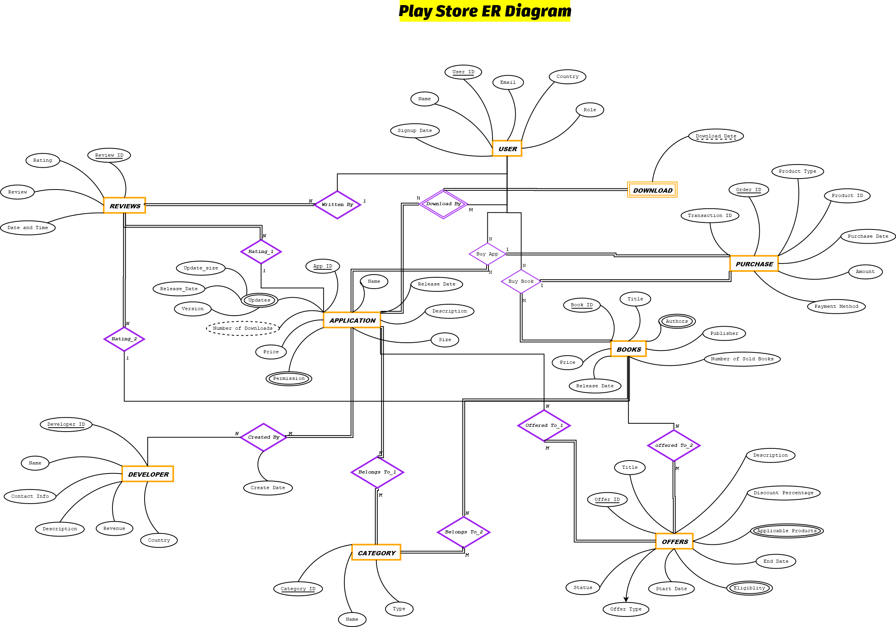

<div align="center">

# 🛒 Playstore Database Management System

**A production-grade relational database modelling the Google Play Store ecosystem**

[](https://www.postgresql.org/)
[](https://en.wikipedia.org/wiki/SQL)
[](#normalization)
[](#)

</div>

---

## 📌 Table of Contents

- [Overview](#-overview)
- [Entity-Relationship Diagram](#-entity-relationship-diagram)
- [Database Schema](#-database-schema)
- [Normalization](#-normalization)
- [Triggers & Business Logic](#-triggers--business-logic)
- [Tech Stack](#-tech-stack)
- [Project Structure](#-project-structure)
- [Getting Started](#-getting-started)
- [Sample Queries](#-sample-queries)
- [Team](#-team)

---

## 🔍 Overview

This project implements a **fully normalized relational database** for a Play Store–style digital marketplace. It models real-world entities including mobile applications, books, users, developers, purchases, reviews, and promotional offers — mirroring the architecture and business logic of the **Google Play Store**.

### What makes this project stand out?

| Feature | Detail |
|---|---|
| **Schema Design** | 21 normalized tables, all verified in BCNF |
| **Referential Integrity** | Foreign key constraints across all relational tables |
| **Business Logic via Triggers** | 6 PostgreSQL triggers enforcing real-world rules |
| **Dual Product Support** | Handles both **Applications** and **Books** as purchasable entities |
| **Complex Relationships** | Many-to-many joins for categories, offers, purchases, and downloads |

---

## 🗂️ Entity-Relationship Diagram

The ER diagram captures all core entities and their cardinality relationships.

> **Key Entities:** `USER` · `DEVELOPER` · `APPLICATION` · `BOOKS` · `CATEGORY` · `PURCHASE` · `OFFERS` · `REVIEWS`

<div align="center">
  
</div>

📄 Full ER diagram, relational schema, and normalization proofs are documented in [`PDF Files/Playstore-DB_ERD_RS_NORM_Final.pdf`](PDF%20Files/Playstore-DB_ERD_RS_NORM_Final.pdf)

---

## 🧱 Database Schema

The database consists of **21 tables** covering the full lifecycle of a digital marketplace.

### Core Entities

| Table | Description |
|---|---|
| `USER` | Registered users with roles (User / Admin) |
| `DEVELOPER` | App developers with revenue tracking |
| `APPLICATION` | Apps with pricing, size, and download count |
| `BOOKS` | Purchasable books with publisher and sales data |
| `CATEGORY` | Shared categories for both apps and books |
| `PURCHASE` | Unified purchase/order record for all transactions |
| `OFFERS` | Promotional offers with date range and discount |
| `REVIEWS` | User reviews and ratings for apps and books |

### Relationship / Junction Tables

| Table | Relationship |
|---|---|
| `CREATED_BY` | Developer ↔ Application (with creation date) |
| `DOWNLOAD_BY` | User ↔ Application (tracks download events) |
| `BUY_APP` | User ↔ Application ↔ Purchase |
| `BUY_BOOK` | User ↔ Book ↔ Purchase |
| `BELONGS_TO_1` | Application ↔ Category |
| `BELONGS_TO_2` | Book ↔ Category |
| `OFFERED_TO_1` | Application ↔ Offer |
| `OFFERED_TO_2` | Book ↔ Offer |

### Multi-valued Attribute Tables

| Table | Stores |
|---|---|
| `PERMISSION` | App-level permission strings |
| `UPDATES` | App version history |
| `AUTHOR` | Multi-author support per book |
| `APPLICABLE_PRODUCTS` | Products eligible for an offer |
| `ELIGIBILITY` | User criteria for an offer |

---

## 📐 Normalization

All 21 relations have been formally proven to satisfy **Boyce-Codd Normal Form (BCNF)**.

The normalization process involved:

1. Identifying all **functional dependencies (FDs)** per relation
2. Computing **minimal covers** (canonical FD sets)
3. Applying **BCNF decomposition** where violations existed
4. Verifying **lossless-join** and **dependency-preservation** properties

📄 Full proofs: [`PDF Files/Playstore-DB_ERD_RS_NORM_Final.pdf`](PDF%20Files/Playstore-DB_ERD_RS_NORM_Final.pdf)

---

## ⚙️ Triggers & Business Logic

Six PostgreSQL triggers enforce data integrity and automate business rules at the database level:

| Trigger | Table | When | Effect |
|---|---|---|---|
| `trg_default_role` | `USER` | `BEFORE INSERT` | Sets `Role = 'User'` if null |
| `trg_unique_permission` | `PERMISSION` | `BEFORE INSERT` | Raises exception on duplicate permission per app |
| `trg_increment_downloads` | `DOWNLOAD_BY` | `AFTER INSERT` | Auto-increments `APPLICATION.Number_of_Downloads` |
| `trg_validate_rating` | `REVIEWS` | `BEFORE INSERT` | Rejects ratings outside the 1–5 range |
| `trg_no_overlapping_offers` | `OFFERED_TO_1` | `BEFORE INSERT` | Prevents concurrent active offers on the same app |

> All trigger logic is implemented as separate `PL/pgSQL` functions for clean separation of concerns and reusability.

📄 Trigger implementations: [`SQL Files/DDL_script_final`](SQL%20Files/DDL_script_final)

---

## 💻 Tech Stack

| Tool | Purpose |
|---|---|
| **PostgreSQL** | Primary RDBMS — DDL, DML, constraints, triggers |
| **PL/pgSQL** | Procedural language for trigger functions |
| **SQL** | Schema definition, queries, normalization verification |
| **Dia / Draw.io** | ER diagram design |
| **Git & GitHub** | Version control and collaboration |

---

## 📁 Project Structure

```
Playstore-DBMS/
│
├── SQL Files/
│   └── DDL_script_final         # Full DDL: tables, constraints, triggers
│
├── PDF Files/
│   ├── Playstore-DB_ERD_RS_NORM_Final.pdf    # ER diagram, relational schema, BCNF proofs
│   ├── Playstore-DB_INSERT_OP_Final.pdf      # Sample INSERT operations
│   └── Playstore-DB_Query's_Final_.pdf       # SQL queries and output screenshots
│
├── DBMS_Project_image.png        # ER diagram image preview
└── README.md
```

---

## 🚀 Getting Started

### Prerequisites

- PostgreSQL 14+ installed ([Download here](https://www.postgresql.org/download/))
- `psql` CLI or [pgAdmin](https://www.pgadmin.org/) GUI

### Setup Instructions

**1. Clone the repository**
```bash
git clone https://github.com/your-username/Playstore-DBMS.git
cd Playstore-DBMS
```

**2. Create the database**
```sql
CREATE DATABASE playstore_db;
```

**3. Connect and run the DDL script**
```bash
psql -U postgres -d playstore_db -f "SQL Files/DDL_script_final"
```

**4. (Optional) Load sample data**

Refer to [`PDF Files/Playstore-DB_INSERT_OP_Final.pdf`](PDF%20Files/Playstore-DB_INSERT_OP_Final.pdf) for sample `INSERT` statements.

---

## 🔎 Sample Queries

A few examples of the queries implemented and documented in this project:

```sql
-- Get all apps downloaded by a specific user
SELECT A.Name, D.Download_Date
FROM APPLICATION A
JOIN DOWNLOAD_BY D ON A.App_ID = D.App_ID
WHERE D.User_ID = 101;

-- Find all active offers and the apps they apply to
SELECT O.Title, O.Discount_Percentage, A.Name AS App_Name
FROM OFFERS O
JOIN OFFERED_TO_1 OT ON O.Offer_ID = OT.Offer_ID
JOIN APPLICATION A ON OT.App_ID = A.App_ID
WHERE CURRENT_DATE BETWEEN O.Start_Date AND O.End_Date;

-- Top 5 most downloaded apps
SELECT Name, Number_of_Downloads
FROM APPLICATION
ORDER BY Number_of_Downloads DESC
LIMIT 5;
```

📄 Full query set with outputs: [`PDF Files/Playstore-DB_Query's_Final_.pdf`](PDF%20Files/Playstore-DB_Query's_Final_.pdf)

---

## 👥 Team

Developed as part of a **Database Management Systems (DBMS)** course project.

> 💡 *Want to contribute or found a bug? Feel free to open an issue or submit a pull request.*

---

<div align="center">

**⭐ If you found this project useful, consider giving it a star!**

</div>
